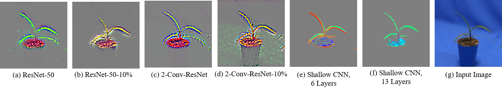

# Visualizing Feature Maps for Model Selection in Convolutional Neural Networks

Using this code you can visualize the features represented by a layer in a CNN using Guided Backpropagation (GBP) and calculate the SSIM Cut to find optimal depth to avoid overfitting.

## Requirements
Python 3.7 or later

see `requirement.txt` for exact authors environment.

## Training the ResNet-50
At first, we need to train a model and save the model. The following code will train a model on Weedling dataset and save the model that has the highest testing accuracy.

```
python Train_ResNet_Save_Model.py
```

## Calculating GBP of Each Convolutional Layer of ResNet-50
Next, we need to calculate GBP of each convolutional layer of ResNet-50, as follows

```
python Save_Layerwise_GBP.py
```

Save_Layerwise_GBP.py takes a trained model and saves the GBP of each layer in, 'results/'.


## SSIM Cut
Finally we need to run 

```
python SSIM_Cut.py
```

SSIM_Cut.py takes the generated GBP images and calculate the SSIM Cut Curve for that model and saves the result in, './results'.


## Results

Here is an example of the GBP of different models on the Weedling dataset:


_GBP of the final convolutional layer for different CNN models used in the study on the Weedling dataset._
